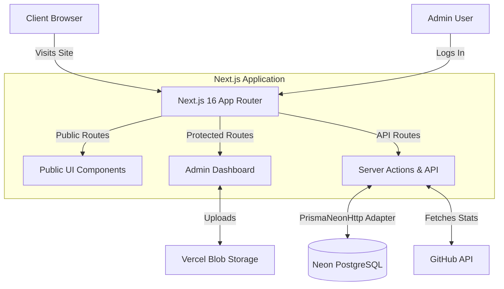

# Debadrita Goswami - Personal Portfolio
[](https://nextjs.org/)
[](https://www.typescriptlang.org/)
[](https://www.prisma.io/)
[](https://www.postgresql.org/)
[](https://tailwindcss.com/)

A modern, high-performance personal portfolio and content management system built with the **Next.js 16 App Router**. This repository powers both the public-facing portfolio website and a secure, bespoke Admin panel used to manage dynamic content like blogs, projects, certifications, and experiences.

---

## 🌟 Key Features

- **Blazing Fast Public Site:** Statically generated and edge-cached pages for showcasing projects, reading technical blogs, and viewing professional experience.
- **Bespoke Admin CMS:** A JWT-authenticated, secure dashboard for complete CRUD management of all portfolio content.
- **Serverless PostgreSQL:** Powered by Neon Database with `@neondatabase/serverless` and Prisma HTTP adapters to bypass restrictive firewalls.
- **Rich Media Storage:** Integrated with Vercel Blob for seamless image and file uploads directly from the Admin panel.
- **Advanced SEO:** Built-in dynamic metadata generation, Open Graph tags, automated sitemaps, robots.txt, and structured JSON-LD data.
- **Fluid Animations:** Smooth scrolling and micro-interactions powered by Framer Motion, GSAP, and Lenis.

---

## 🏗️ Architecture Overview

The application is split into two primary domains: the **Public Facing Site** and the **Admin CMS**.



---

## 🔄 Complete Work Workflow

Whether you are developing new features, publishing content, or contributing to the repository, this project follows a highly structured, enterprise-grade workflow.

```mermaid
flowchart TD
    subgraph Content_Workflow ["✍️ Content Management Workflow"]
        A1[Log in to /admin] --> A2[Access Admin Dashboard]
        A2 --> A3[Upload Assets to Vercel Blob]
        A3 --> A4[Submit Form to Next.js API]
        A4 --> A5[Prisma HTTP Adapter Saves to Neon DB]
        A5 --> A6[Instant ISR / SSR Cache Revalidation]
        A6 --> A7[Public Website Updated]
    end

    subgraph Dev_Workflow ["🛠️ Developer Contribution Workflow"]
        B1[Create Feature Branch] --> B2[Local Dev & Next.js Hot Reload]
        B2 --> B3[Prisma DB Push / Migrate]
        B3 --> B4[Run Typecheck & Linting]
        B4 --> B5[Git Commit & Push]
        B5 --> B6[Vercel Automated Build & Deployment]
    end
```



### 1. Content Management Workflow (Site Owners)
How data moves from the admin interface to the public site:
- **Authentication:** Log into `/admin/login` (generates a secure, HTTP-only JWT cookie).
- **Create/Edit:** Navigate to the specific module (e.g., Projects, Blogs) in the Admin Dashboard.
- **Media Upload:** Upload cover images or assets. These are directly streamed to **Vercel Blob** and a CDN URL is generated.
- **Database Save:** Content is saved to the Neon PostgreSQL database via Prisma ORM.
- **Live Preview:** The Next.js app router automatically revalidates the cache, and the new content is instantly visible on the public portfolio.

### 2. CI/CD & Deployment Workflow
This project utilizes automated continuous integration and deployment pipelines via Vercel:
- **Automated Builds:** Pushing to the `main` branch automatically triggers a Vercel production build.
- **Database Migrations:** During the build step, `npx prisma generate` runs automatically to ensure the Prisma client matches the latest schema.
- **Preview Deployments:** Pushing to any non-main branch (e.g., `feature/new-ui`) automatically generates a Vercel Preview URL for testing before merging.

### 3. Developer Contribution Workflow
Standard Git flow for adding new features or modifying the codebase:
1. **Branching:** Create a new feature branch from `main` (`git checkout -b feature/your-feature-name`).
2. **Local Development:**
   - Run `npm run dev`
   - Make changes to components, APIs, or styles.
3. **Database Changes (If required):**
   - Modify `prisma/schema.prisma`.
   - Apply changes: `npx prisma db push` (for rapid dev) or `npx prisma migrate dev` (for production tracking).
   - Regenerate client: `npx prisma generate`.
4. **Testing & Linting:** 
   - Ensure `npm run typecheck` and `npm run lint` pass without errors.
5. **Commit & Push:** Commit your changes with descriptive messages and push to GitHub.
6. **Pull Request:** Open a Pull Request (PR) against the `main` branch. Wait for Vercel Preview checks to pass before merging.

### 4. Issue & Bug Reporting Workflow
If you encounter a bug or wish to request a feature:
1. Navigate to the GitHub **Issues** tab.
2. Check if the issue has already been reported.
3. Create a new issue using a clear title and detailed description (including steps to reproduce for bugs).
4. Assign appropriate labels (e.g., `bug`, `enhancement`).

---

## 🚀 Getting Started Locally

### Prerequisites
- Node.js 20+
- A [Neon Database](https://neon.tech) (PostgreSQL)
- A [Vercel](https://vercel.com) account (for Blob Storage)

### 1. Clone & Install
```bash
git clone https://github.com/debagoswami83/portfolio.git
cd portfolio
npm install
```


### 2. Initialize Database
Push the Prisma schema to your Neon database to create the necessary tables:
```bash
npx prisma db push
npx prisma generate
```

### 3. Start Development Server
```bash
npm run dev
```
Navigate to `http://localhost:3000` to view the public site, or `http://localhost:3000/admin` to access the CMS.

---

## 📁 Project Structure

```text
├── prisma/
│   ├── schema.prisma      # Database models and relations
│   └── seed.ts            # Initial database population script
├── src/
│   ├── app/
│   │   ├── admin/         # Protected CMS routes
│   │   ├── api/           # Route handlers (Auth, CRUD, GitHub)
│   │   └── (public)/      # Public facing pages (Home, Blogs, etc.)
│   ├── components/        # Reusable React components (UI, Admin, Layout)
│   └── lib/
│       ├── db/            # Prisma client and query helpers
│       ├── utils.ts       # Shared utility functions
│       └── auth.ts        # JWT and session management
└── public/                # Static assets (fonts, images, icons)
```

---

## 🔗 Quick Links

- **Live Site:** [debagoswami.tech](https://www.debagoswami.tech)
- **GitHub:** [debadritax24](https://github.com/debadritax24)
- **LinkedIn:** [Debadrita Goswami](https://www.linkedin.com/in/debagoswami83/)

---
*Built with ❤️ by Debadrita Goswami.*
